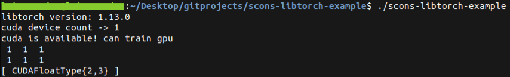

# simple simple scons setup for libtorch with gpu access

simple scons setup for libtorch with gpu access<br> 
compiling on ubuntu 22.04 with global CUDA-11.4 install and 470 driver<br>

## ubuntu setup

(get release from next link structure) <br>
```
$ wget https://download.pytorch.org/libtorch/nightly/cuxxx/libtorch-shared-with-deps-latest.zip
scons
```

**output commands**

```
/usr/bin/g++ -o src/main.o -c -std=c++17 -D_GLIBCXX_USE_CXX11_ABI=0 -Ilibs/libtorch/include -Ilibs/libtorch/include/torch/csrc/api/include -I. -I/usr/local/cuda-11.4/include -Ilibs/stb src/main.cpp
/usr/bin/g++ -o scons-libtorch-example -Wl,-R/home/luisarandas/Desktop/gitprojects/scons-libtorch-example/libs/libtorch/lib src/main.o -L/usr/local/cuda-11.4/lib64 -Llibs/libtorch/lib -ltorch -ltorch_cpu -ltorch_cuda_cpp -ltorch_cuda_cu -ltorch_cuda_linalg -ltorch_python -ltorch_global_deps -ltorch_cuda -lc10
```

